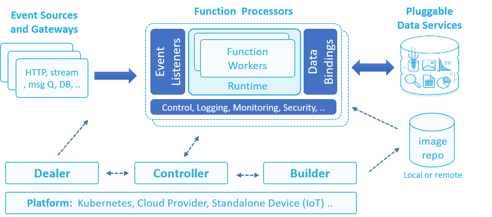

# **nuclio** – “Serverless” for real-time events and data processing  
nuclio is a new serverless project, derived from iguazio’s elastic “data lifecycle management” service for high-performance events and data processing. nuclio is being extended to support large variety of event and data sources, it can run as a standalone binary (e.g. for IoT devices), be packaged in a docker container, or integrate with a container orchestrator like Kubernetes.

nuclio is super fast, a single function instance can process hundreds of thousand http requests or data records per second, that's 10-100x faster than other frameworks, see more in [benchmarks]()  

>**Note:** nuclio is still under development and not recommended for production use
## Why another “serverless” project ?
We considered existing cloud and open source serverless, none addressed our needs:

 - Real-time processing with minimal CPU and IO overhead and maximum parallelism 
 - Native integration with large variety of data/event sources and processing models 
 - Abstracting data resources from the function code to enable re-use, simplicity, portability, and data path acceleration
 - Simple debugging, regression testing, and multi-versioned CI/CD pipelines
 - Portability across low-power devices, laptops, on-prem cluster, and public cloud

We designed nuclio for extensibility using a modular and layered approach, we hope many will join us in developing new modules, integrations with more event sources, data sources, developer tools, and cloud platform integrations.   
## nuclio high-level architecture



**Processors** - listen on one or more event sources (e.g. HTTP, Message Queue, Stream) and execute user functions with one or more parallel workers. The workers use language specific runtimes to execute the function (via native calls, shmem, or shell). Processors integrate with platform facilities for logging, monitoring, and configuration through abstract interfaces allowing greater portability and extensibility, e.g. can log to screen, file, or log stream.
 
**Controller** - accept function and event source specifications, invoke builders and processors through orchestration platform (such as Kubernetes), and manage function elasticity, lifecycle and versions.  

**Event Sources** - Functions can be invoked through a variety of event sources (e.g. HTTP, RabitMQ, Kafka, Kinesis, DynamoDB, iguazio v3io, schedule, etc’) which are defined in the function spec. Event sources are divided to few event classes (req/rep, async, stream, pooling) which define their behaviour. Different event sources can plug seamlessly to the same function without sacrificing performance, allowing portability, reuse, and flexibility.  

**Data Bindings** -  allow a user to specify persistent input/output data resources used by the function (data connections are preserved between executions).  Bound data can be in the form of files, objects, records, messages etc. the function spec may include an array of data binding definitions, each specifying the data resource, its credentials and usage parameters. Data bindings abstraction allow using the same function with different data sources of the same type and enable function portability.

**Builder** - take raw code, optional build instructions and dependencies and generate the function artifact (binary or docker container image), it can push the container image to a specified image repository. The builder can run in the context of the CLI or as a seperate service for automated development pipelines. 

**Dealer** - used with streaming and batch jobs to distribute a set of tasks or data partitions/shards among the available function instances and guarantee all tasks are concluded successfully. For example if a function reads from a message stream with 20 partitions it will guarantee the partitions are distributed evenly across workers taking into account the number of function instances and failures.

**nuclio SDK** - used by function developers to write, test, and submit their code without having the entire nuclio source tree

>See more details on the architecture in [Architecture]()

## Getting Started Example
you can see the sdk [examples]() directory for more advanced examples  
### Create a new function 
Download nuclio golang sdk
```go get -d github.com/nuclio/nuclio-sdk/...```

Create a simple function like the one below and save in a file (example.go)

```golang
package handler

import (
    "github.com/nuclio/nuclio-sdk"
)

func Handler(context *nuclio.Context, event nuclio.Event) (interface{}, error) {
    context.Logger.Info("Request received: %s",event.GetURL())

    return nuclio.Response{
        StatusCode:  200,
        ContentType: "application/text",
        Body: []byte("Response from handler"),
    }, nil
}
```

### Build and Execute in standalone mode 
Download the CLI from [cli packages]() or build from source by running:
```
go install aa\bb
```
you can see a full CLI guide in [here]() or just run `nuclio --help` once its installed
Build the example by running the following cli command:
```
nuclio build example -p .\ --handler Handler
```
Advanced build options and package or binary dependencies can be specified in the `build.yaml` file located in the root path of the source code, can see the [examples]() for details or read about the [builder]().

Run the processor locally, use a browser to access the function at port 8080

```
docker run -p 8080:8080 example:latest
```


### Execute on a Kubernetes Cluster

#### Prepare the cluster 
First make sure you have a working kubernetes cluster and kubectl (kubernetes cli).
Can see a detailed explanation on how to properly install and configure kubernetes and optionally create a local docker image repository in the [following link]().

Verify nuclio controller deployment is running or start it using the following command: 
```bash
kubectl create -f http://path/to/controller.yaml
```
#### Build or Run the function
If we plan on creating multiple function instances from the same code we can `build` the function and push the image to a local/remote repository, later on we can create different instances and specify unique parameters and environment variables for every instance using the `run` command flags. Or we can build and run the function in a single `run` command, we will demonstrate the later option.

```
nuclio run myfunc -p .\ --handler Handler --port 32000 -k kubeconf
```
the `-k` option specify the path to the Kubernetes config file, it can also be specified once using the standard  `KUBECONFIG` environment variable. 

if the function was already built and pushed to the repository we can just specify the function image path with the `-i` option, this will skip the build phase and doesnt require specifing build parameters (path, handler, ..).

#### Test the function
We can verify that our function was created using the `nuclio get` command and invoke the function using the `nuclio exec` command.

```
>nuclio get fu
  NAMESPACE | NAME  | VERSION |   STATE   |      LOCAL URL      | HOST PORT | REPLICAS
  default   | hello | latest  | processed | 10.107.164.223:8080 |     31010 | 1/1
  default   | kuku  | latest  | processed | 10.96.188.133:8080  |     31077 | 1/1
```

```
nuclio exec myfunc -b bodystring 
```

**Note:** Since the functions are implemented as a Custom Resource Definition (CRD) in Kubernetes, we can also create a function using the Kubernetes `kubectl` command line utility and APIs, for example `kubectl create -f function.yaml`, we recomend using the CLI since it is more robust and conduct step by step verification. 

nuclio controller will automatically create the kubernetes function, pods, deployment, service, and optionally pod auto-scaler. we can also view our function status using ```kubectl get functions``` or watch the kubernetes deployments and services with our function name and proper labels.

to access the function we can HTTP to the exposed local or remote function service port (external ports are secified with the `--port` cli option).
>**Note:** if we want to create a custom API url to our function we can use kubernetes [ingress]() resources, in future version this task will be automated  

#### Function versioning 

By default functions are tagged with version `latest`, versions can be published and assigned aliases (e.g. production, beta, ..)
older versions can be viewed in the CLI and can be managed independently. older versions are immutable and cannot be modified.

to publish a function and tag it with an alias use:
``` nuclio update myfunc --publish --alias prod```

#### Using the function.yaml file
Like other kubernetes resources the functions can be specified or retrived using yaml or json files, it allows granular and reusable specification of function parameters, events and data bindings. you can see details in the [function spec documentation]().  

A function yaml can look like:

```yaml
apiVersion: "nuclio.io/v1"
kind: Function
metadata:
  name: example
spec:
  image: example:latest
  replicas: 1
  httpPort: 31000
  env:
  - name: SOME_ENV
    value: abc
```
You can create functions from the yaml/json files by specifing the `-f` option in the `run` or `build` cli commands, you can also use the yaml/json file as a template and override each one of the parameters with command line arguments. 
In the following example we create a function from a template file and override the name and one environment variable:  
```
nuclio run myfunc -f function.yaml -e ENV_PARAM=somevalue
```
and can retrive the full function spec and status using: 
```
nuclio get myfunc -o yaml
```

## To start developing nuclio

TBD how to clone the repo, build and develop basics 

## Support 
can check out our [FAQ]() or post questions to nuclio [slack channel]()  
