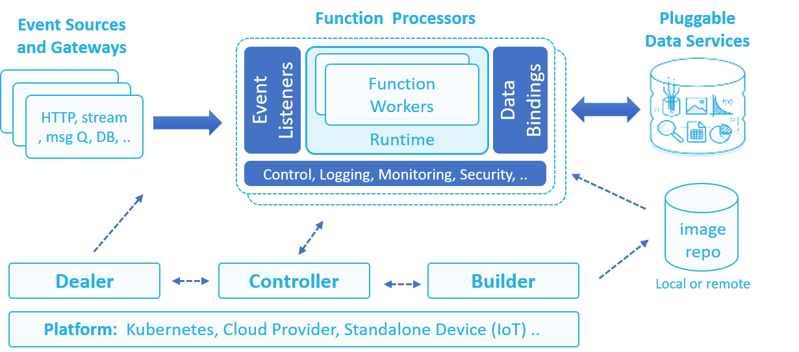

[](https://travis-ci.org/nuclio/nuclio)
[](https://goreportcard.com/report/github.com/nuclio/nuclio)

<p align="center"></p>
# nuclio &mdash; "Serverless" for Real-Time Events and Data Processing

nuclio is a new serverless project, derived from iguazio's elastic data life-cycle management service for high-performance events and data processing.
nuclio is being extended to support a large variety of event and data sources.
You can use nuclio as a standalone binary (for example, for IoT devices), package it within a Docker container, or integrate it with a container orchestrator like Kubernetes.

nuclio is extremely fast. A single function instance can process hundreds of thousands of HTTP requests or data records per second.
This is 10&ndash;100 times faster than some other frameworks. See [nuclio Architecture](docs/architecture.md) to learn how it works.

**Note:** nuclio is still under development, and is not recommended for production use.

**In This Document**
- [Why Another "serverless" Project?](#why-another-serverless-project)
- [nuclio High-Level Architecture](#nuclio-high-level-architecture)
- [Getting Started Example](#getting-started-example)
- [Function Versioning](#function-versioning)
- [Function Configuration and Metadata](#function-configuration-and-metadata)


## Why Another "serverless" Project?

We considered existing cloud and open-source serverless solutions, but none addressed our needs:

-  Real-time processing with minimal CPU and I/O overhead and maximum parallelism
-  Native integration with a large variety of data and event sources, and processing models

-  Abstraction of data resources from the function code, to support code portability, simplicity, and data-path acceleration
-  Simple debugging, regression testing, and multi-versioned CI/CD pipelines
-  Portability across low-power devices, laptops, on-prem clusters, and public clouds

We designed nuclio to be extendable, using a modular and layered approach.
We hope many will join us in developing new modules and integrations with more event and data sources, developer tools, and cloud platforms.


## nuclio High-Level Architecture



<dl>
  <dt>Function Processors</dt>
  <dd>A processor listens on one or more event sources (for example, HTTP, Message Queue, Stream), and executes user functions with one or more parallel workers.
      The workers use language-specific runtimes to execute the function (via native calls, SHMEM, or shell).
      Processors use abstract interfaces to integrate with platform facilities for logging, monitoring, and configuration, allowing for greater portability and extensibility (such as logging to a screen, file, or log stream).
  </dd>
</dl>

<dl>
  <dt>Controller</dt>
  <dd>A controller accepts function and event-source specifications, invokes builders and processors through an orchestration platform (such as Kubernetes), and manages function elasticity, life cycle, and versions.
  </dd>
</dl>

<dl>
  <dt>Event Sources</dt>
  <dd>Functions can be invoked through a variety of event sources (such as HTTP, RabitMQ, Kafka, Kinesis, DynamoDB, iguazio v3io, or schedule), which are defined in the function specification.<br />
      Event sources are divided into several event classes (req/rep, async, stream, pooling), which define the sources' behavior.<br />
      Different event sources can plug seamlessly into the same function without sacrificing performance, allowing for portability, code reuse, and flexibility.
  </dd>
</dl>

<dl>
  <dt>Data Bindings</dt>
  <dd>Data-binding rules allow users to specify persistent input/output data resources to be used by the function.
      (Data connections are preserved between executions.)
      Bound data can be in the form of files, objects, records, messages etc.<br />
      The function specification may include an array of data-binding rules, each specifying the data resource and its credentials and usage parameters.<br />
      Data-binding abstraction allows using the same function with different data sources of the same type, and enables function portability.
  </dd>
</dl>

<dl>
  <dt>Builder</dt>
  <dd>A builder receives raw code and optional build instructions and dependencies, and generates the function artifact &mdash; a binary file or a Docker container image, which the builder can also push to a specified image repository.<br />
      The builder can run in the context of the CLI or as a separate service for automated development pipelines.
  </dd>
</dl>

<dl>
  <dt>Dealer</dt>
  <dd>A dealer is used with streaming and batch jobs to distribute a set of tasks or data partitions/shards among the available function instances, and guarantee that all tasks are completed successfully.
      For example, if a function reads from a message stream with 20 partitions, the dealer will guarantee that the partitions are distributed evenly across workers, taking into account the number of function instances and failures.
  </dd>
</dl>

<dl>
  <dt>nuclio SDK</dt>
  <dd>The nuclio SDK is used by function developers to write, test, and submit their code, without the need for the entire nuclio source tree.
  </dd>
</dl>

For more information about the nuclio architecture, see [nuclio Architecture](docs/architecture.md).


## Getting-Started Example

Following is a basic step-by-step example of using the nuclio Go (golang) SDK.
For more advanced examples, see the [examples](https://github.com/nuclio/nuclio-sdk/tree/development/examples) directory in the nuclio-sdk repository.

### Get the nuclio Artifacts

#### Download the nuclio SDK

Download the nuclio Go SDK (**nuclio-sdk**) by running the following command:
```
go get -d github.com/nuclio/nuclio-sdk
```

#### Download and Build the nuclio CLI

Run the following commands to download the source files of the nuclio CLI (**nuctl**), build the CLI, and add it to your path:
```
go get github.com/nuclio/nuclio/cmd/nuctl
export PATH=$PATH:$GOPATH/bin
```

You can find a full CLI guide [here](docs/nuctl/nuctl.md), or just run `nuctl --help` after installing nuctl.

### Create a New Function

Create an **example.go** file, add code to import the nuclio SDK, and define a `Handler` function that uses the SDK.

Following is an example of a simple function that returns the text "Hello, World":
```golang
package handler

import (
    "github.com/nuclio/nuclio-sdk"
)

func Handler(context *nuclio.Context, event nuclio.Event) (interface{}, error) {
    return "Hello, World", nil
}
```

A more advanced function, demonstrated below, uses the `Event` and `Context` interfaces to handle inputs and logs, and returns a structured HTTP response instead of a simple text string.
This implementation provides you with more granular control over the output.
```golang
package handler

import (
    "github.com/nuclio/nuclio-sdk"
)

func Handler(context *nuclio.Context, event nuclio.Event) (interface{}, error) {
    context.Logger.Info("Request received: %s", event.GetURL())

    return nuclio.Response{
        StatusCode:  200,
        ContentType: "application/text",
        Body: []byte("Response from handler"),
    }, nil
}
```

### Build and Execute the Function

Use any of the following supported methods to build and execute your function.

#### Build and Execute the Function Locally

1.  Build the sample `Handler` function by running the following CLI command.
    Replace <i><example.go&nbsp;directory></i> with the path to the directory that contains your **example.go** file:
    ```
    nuctl build example -p <example.go directory>
    ```

    Advanced build options and package or binary dependencies can be specified in the `build.yaml` file, which is located in the root path of the source code.
    See the nuclio-sdk [examples](https://github.com/nuclio/nuclio-sdk/tree/development/examples) for sample uses<!--, or read the [builder documentation]()-->.

2.  Run the processor locally to serve the function.
    The following command serves the function on port 8080:
    ```
    docker run -p 8080:8080 example:latest
    ```
    Then, use a browser to access the function on the specified port (8080 in this example).

#### Build and Execute the Function on a Kubernetes Cluster

1.  **Prepare the Kubernetes cluster:**

    1.  Ensure that you have a working Kubernetes cluster and the Kubernetes CLI (**kubectl**).
        For a detailed explanation on how to properly install and configure Kubernetes, and optionally create a local Docker image registry, see the [Creating a nuclio Kubernetes Cluster](docs/k8s).

    2.  Verify that the nuclio controller deployment is running, or use the following command to start it:
        ```bash
        kubectl create -f https://raw.githubusercontent.com/nuclio/nuclio/development/hack/k8s/resources/controller.yaml
        ```

2.  **Point the CLI to your Kubernetes configurations:**
    To enable the nuclio CLI to connect to the Kubernetes cluster, you need to point the CLI to a Kubernetes configuration file.
    You can define a default configuration file either by saving the file in the default Kubernetes configuration path &mdash; **~/.kube/config/** &mdash; or by setting the `KUBECONFIG` environment variable to the path to the configuration file.
    You can also use the CLI `-k` option to point to a Kubernetes configuration file for a specific command, overriding the default configuration (if set).

3.  **Build or run the function:**
    If you intend to create multiple function instances from the same code, you can use the CLI `build` command to build the function and push the build image to a local or remote repository.
    You can then create different instances of the function, at any time, and specify unique parameters and environment variables for each instance by using the `run` command options.
    Alternatively, you can build and run the function by using a single `run` command, as demonstrated here.
    Replace <i><example.go&nbsp;directory></i> with the path to the directory that contains your **example.go** file:
    ```
    nuctl run myfunc -p <example.go directory> -r <cluster-ip:31276>
    ```
    In the above command, `-r <cluster-ip:31276>` is passed to indicate the location to which to push the function image.
    If you followed the [Creating a nuclio Kubernetes Cluster](docs/k8s) guidelines, you should have a docker registry in your Kubernetes cluster that listens on node port 31276.
    You can, of course, use any another docker registry (or the docker hub), and adjust the instructions in this guide accordingly.

    When a function has already been built and pushed to the repository, you can use the `-i` option of the `run` command to set the function's image path.
    Setting this option skips the build phase, thereby eliminating the need to specify any build parameters (such as the path or the name of the handler function).

3.  **Test your function:**
    Use the nuctl `get` command to verify your function:
    ```
    nuctl get fu
    ```
    Following is a sample output for this command:
    ```
      NAMESPACE | NAME    | VERSION | STATE     | LOCAL URL           | NODE PORT | REPLICAS
      default   | hello   | latest  | processed | 10.107.164.223:8080 |     31010 | 1/1
      default   | myfunc  | latest  | processed | 10.96.188.133:8080  |     31077 | 1/1
    ```

    Use the nuclio `exec` command to invoke the function.
    By default, the command sends an HTTP GET request:
    ```
    nuctl exec myfunc
    ```

    **Note:** Because the functions are implemented as a Custom Resource Definition (CRD) in Kubernetes, you can also create a function using the Kubernetes `kubectl` command-line utility and APIs &mdash; for example, by running `kubectl create -f function.yaml`.
    We recommend using the nuctl CLI, as it is more robust and includes step-by-step verification.

    The nuclio controller automatically creates the Kubernetes function, pods, deployment, service, and optionally a pod auto-scaler.
    You can also view the status of your function by using <code>kubectl&nbsp;get&nbsp;functions</code>, or watch the Kubernetes deployments and services with your function name and proper labels.

    To access the function, you can send HTTP requests to the exposed local or remote function service port (node port).
    (Specific external ports can be specified with the `--port` CLI option.)

    **Note:** If you want to assign a custom API URL to your function, you can use the Kubernetes [ingress resources](https://kubernetes.io/docs/concepts/services-networking/ingress/).
    In future versions of nuclio, this task will be automated.


## Function Versioning

By default, functions are tagged with version `latest`.
Versions can be published and assigned aliases (for example, "production" or "beta").
Earlier versions can be viewed in the CLI, and can be managed independently. Earlier versions are immutable and cannot be modified.

To publish a function and tag it with an alias, use the nuctl `update` command with the `--publish` and `--alias` options, as demonstrated in the following example:
```
nuctl update myfunc --publish --alias prod
```


## Function Configuration and Metadata

Like other Kubernetes resources, a function can be defined or retrieved by using a YAML or JSON function configuration file.
This allows granular and reusable specification of function resources, parameters, events, and data bindings.
For more details, see [Function Configuration and Metadata](docs/function-spec.md).

Following is a sample function YAML configuration file:
```yaml
apiVersion: "nuclio.io/v1"
kind: Function
metadata:
  name: example
spec:
  image: example:latest
  replicas: 1
  env:
  - name: SOME_ENV
    value: abc
```

You can create functions from the YAML or JSON configuration file by specifying the `-f` option in the `run` or `build` CLI commands.
You can also use the configuration file as a template, and override specific parameters with command-line arguments.
The following example uses a **function.yaml** template configuration file to create a function, and explicitly sets the function name and the value of one of the environment variables (overriding the template definitions):
```
nuctl run myfunc -f function.yaml -e ENV_PARAM=somevalue -r <cluster-ip:31276>
```

The following command returns a YAML file with the full function specification and status:
```
nuctl get function myfunc -o yaml
```

