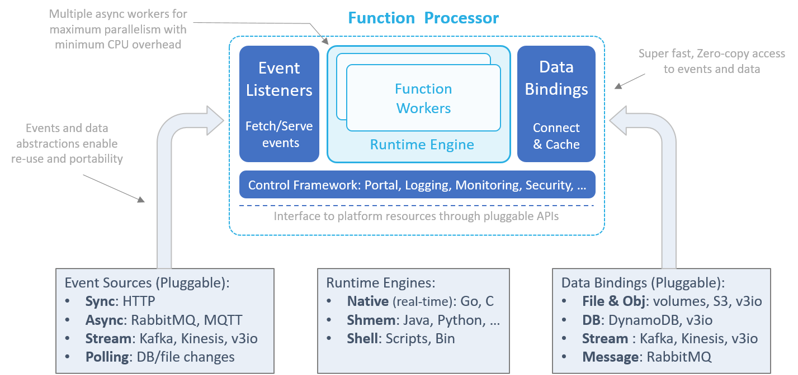
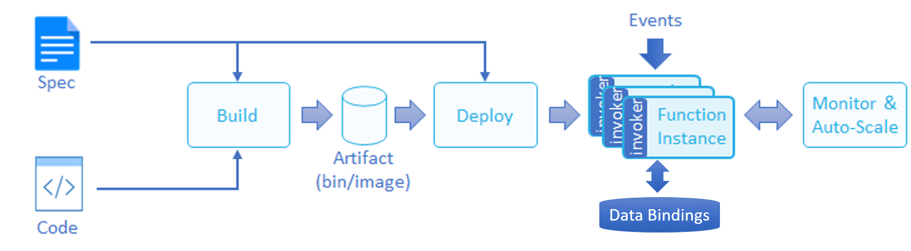

# nuclio Architecture

**In This Document**
- [Function Processors](#function-processors)
- [Event Sources and Mapping](#event-sources-and-mapping)
- [Function Build and Deployment Flow](#function-build-and-deployment-flow)

## Function Processors

Function processors provide an environment for executing functions. The processor feeds functions with events, provides context and data, collects logs and statistics, and manages the function's life cycle.

Processors can be compiled into a single binary (when using Go or C), or packaged into a container with all the required code dependencies. Processor containers can run as standalone Docker containers, or on top of a container-orchestration platform such as Kubernetes. Each function has its own function processors. Function Processors will be scaled-out automatically (by adding more container instances) to address high event frequency.

### Processor Architecture

nuclio's unique processor architecture is aimed at maximizing function performance and providing abstractions and portability across a wide set of platforms, event sources, and data services.

The processor has four main components:

#### Event-Source Listeners

Event-source listeners can listen on sockets and message queues, or periodically fetch events from external event or data sources. Received events share a common schema, which decouples the function logic from the event source implementation or specific structure, and pushed to one or more parallel runtime workers.

The event listeners also guarantee exactly-once or at-least-once event execution and handle failures - for example, by storing stream checkpoints, acknowledging or retrying message-queue events, or responding to HTTP client requests.

#### Runtime Engine

The runtime engine ("runtime") initializes the function environment (variables, context, log, data bindings, etc.), feeds event objects into functions workers, and returns responses to the event sources.

Runtimes can have multiple independent parallel workers (for example, Go routines, Python asyncio, Akka, or threads) to enable non-blocking operations and maximize CPU utilization.

nuclio currently supports three types of processor runtime implementations:

1.	**Native** - for real-time and inline Go or C-based routines.
2.	**SHMEM** - for shared-memory languages, such as Python, Java, and Node.js. The processor communicates with the SHMEM function runtime through zero-copy shared-memory channels.
3.	**Shell** - for command-line execution functions or binaries ("executables"). Upon receiving an event, the processor runs the executable in a command-line shell, using the relevant command and environment variables, and then maps the executable's standard-output (`stdout`) or standard-error (`stderr`) logs to the function results.

    > **Note:** The shell runtime supports only file data bindings.

#### Data Bindings

Functions can benefit from persistent data connections to external files, objects, databases, or messaging systems. The runtime initializes the data-service connection based on the type, URL, properties, and credentials specified in the function specification, and serves them to the function through the context object.

Data bindings simplify development by eliminating the need to integrate with SDKs or manage connections and credentials. They also enable function reuse and portability, because different data services of the same class are mapped to the function using the same APIs.

Data bindings can also handle aspects of data prefetching, caching, and micro-batching, to reduce execution latency and increase I/O performance. Data bindings and event sources are designed with zero-copy, zero-serialization, and non-blocking operation, and enable real-time performance without the need for any special function code.

#### Control Framework

The control framework initializes and controls the different processor components, provides logging for the processor and the function (stored in different log streams), monitors execution statistics, and serves a mini portal for remote management.

The control framework interacts with the underlining platform through abstract interfaces, allowing for portability across different IoT devices, container orchestrators, and cloud platforms. The platform-specific processor configuration is done through a **processor.yaml** file in the working directory. Function developers should not modify this file. The underlying interfaces of the function processors to the required platform services are all abstracted in a way that enables porting the same function processor among different deployments types.

## Event Sources and Mapping

Functions are event-driven. They respond to event triggers, data messages, or records that are accepted from the event source and pushed to the function runtime engine.

Event sources can be divided into classes, based on their behavior and flow management. Each class can have multiple event-source implementations. nuclio supports the following event classes:

1.	**Synchronous Request/Response** - the client issues a request and waits for an immediate response. For example, HTTP requests or Remote Procedure Calls (RPCs).
2.	**Asynchronous Message-Queue Request** - messages are published to an exchange and distributed to subscribers. For example, RabbitMQ, MQTT, emails, or scheduled events.
3.	**Message or Record Streams** - an ordered set of messages or record updates is processed sequentially. For example, Kafka, AWS Kinesis or iguazio V3IO streams.
4.	**Record or Data Polling (ETL)** - a filtered set of records or data objects is retrieved from an external data source or database. The retrieval can be done periodically or triggered by data changes.

New event classes and event sources can be added to the processor framework.

### Event-Source Mapping

Event sources are mapped to a specific function version. For example, the API gateway web URL "/" may be mapped to the "production" version, and the URL "/beta" may be mapped to the "beta" version of the same function. The user needs to specify the event mapping in the function specification, or by using event mapping CRUD API calls or CLI commands. (The current CLI version does not yet support event mapping, and still requires some manual configuration.)

Multiple event sources can be associated with the same function, and the same event can trigger the invocation of multiple functions.

The event-source mapping can utilize either the exact function version or its alias (see details under [versioning](#funciton-versioning)). The mapping also includes information such as the function name, class, type, credentials, and class-specific properties.

### Event Load-Balancing, Sharding, and Dealers

Some jobs involve distributing data or work items across multiple function processor instances. For example, a Kafka stream can be divided into several partitions, and each partition should only be processed by a single processor at any given time. Or in the case of a sharded dataset, you might want to scale-out the processing of the dataset across multiple processing elements, which requires a resource-scheduling entity that will distribute data partitions to the available processors and track the execution and completion.

nuclio includes a "dealer" entity that can dynamically distribute N resources (shards, partitions, tasks, etc.) to M processors, and can handle aspects of failures and scale-up or scale-down of resources and processors.

### Event Object (Used by the Function)

Functions are called with two elements, the context object and the event object. The event object describes the data and metadata of the incoming event. It is generalized in a way that decouples the actual event source from the function. A single function can be driven by multiple types of event sources. A function can accept a single event or an array of events (for example, when using a stream).

An event object is accessed through interfaces (methods). To enable zero-copy, eliminate serialization overhead, and add robustness, an event object can also be consumed as a JSON object, which might add some serialization and deserialization overhead. There are common event-object interfaces, such as `EventID`, `Body`, `ContentType`, `Headers`, `Fields`, and `AsJson`. There are also event-object interfaces that are class-specific.

## Function Build and Deployment Flow

You begin the development flow by implementing the function in one of the supported languages. You then build the function artifacts (a code binary, package, or container image), deploy the function on the destination cluster, and feed it with events and data, as illustrated in the following diagram.

Each function has a version-specific function specification ("spec"). The function spec defines different aspects of the function, such as its code, data binding, environment resources, credentials, and event sources. 
The function spec can be written in YAML or JSON, and can also be defined or overwritten using command-line options. 
The builder uses the function spec in the compilation phase, and the controller uses the spec to identify the operating requirements for the function.

The user can control whether to build and deploy the function in a single operation, or whether to perform each step separately. 
The `build` command compiles the function and builds the artifact, so it can later be used by one or more deployments of the function. 
The `run` command can accept sources, and can either both build and deploy the function, or skip the build and deploy an existing artifact.

The user can control the exact build flags through an optional **build.yaml** file that is located in the same directory as the function sources.

## Function Versioning

nuclio supports function versioning. You can publish a new version of a function and tag it with aliases for referencing the function.

nuclio provides the ability to run different versions of the same function simultaneously (for example, production and beta versions).

The event-source mapping can either specify the exact function version, or utilize a defined alias and thus eliminate the need to change the mapping when a newer version of the function is published.

