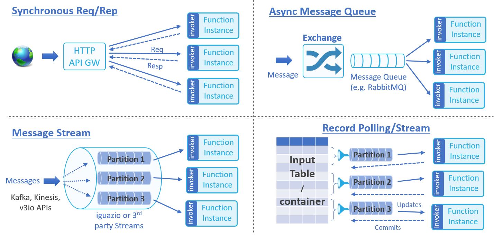

# nuclio Architecture

**In This Document**  
- [Function Processors](#function-processors)
- [Event Sources and Mapping](#event-sources-and-mapping)
- [Function Build and Deployment flow](#function-build-and-deployment-flow)

## Function Processors

Function processors provide an environment for executing functions.
The processor feeds functions with events, provides context and data, collects logs and statistics, and manages the function's life cycle.  

Processors can be compiled into a single binary (when using Go or C), or packaged into a container with all the required code dependencies.
Processor containers can run as standalone Docker containers, or on top of a container-orchestration platform such as Kubernetes.
Each function has its own function proceesors. Function Processors will be scaled-out automatically (by adding more container instances) to address high event frequency.  

### Processor Architecture

nuclio's unique processor architecture is aimed at maximizing function performance and providing abstractions and portability across a wide set of platforms, event sources, and data services. 

The processor has four main components:

#### Event-Source Listeners 

Event-source listeners can listen on sockets and message queues, or periodically fetch events from external event or data sources.
Received events share a common schema, which decouples the function logic from the event source implementation or specific structure, and pushed to one or more parallel runtime workers.  
The event listeners also guarantee exactly-once or at-least-once event execution and handle failures &mdash; for example, by storing stream checkpoints, acknowledging or retrying message-queue events, or responding to HTTP client requests.

#### Runtime Engine

The runtime engine ("runtime") initializes the function environment (variables, context, log, data bindings, etc.), feeds event objects into functions workers, and returns responses to the event sources.  
Runtimes can have multiple independent parallel workers (for example, Go routines, Python asyncio, Akka, or threads) to enable non-blocking operations and maximize CPU utilization.

nuclio currently supports three types of processor runtime implementations:  
1.	**Native** &mdash; for real-time and inline Go or C-based routines.

2.	**SHMEM** &mdash; for shared-memory languages, such as Python, Java, and Node.js.  
    The processor communicates with the SHMEM function runtime through zero-copy shared-memory channels.

3.	**Shell** &mdash; for command-line execution functions or binaries ("executables").  
    Upon receiving an event, the processor runs the executable in a command-line shell, using the relevant command and environment variables, and then maps the executable's standard-output (`stdout`) or standard-error (`stderr`) logs to the function results.  
    **Note:** The shell runtime supports only file data bindings.

#### Data Bindings 

Functions can benefit from persistent data connections to external files, objects, databases, or messaging systems.
The runtime initializes the data-service connection based on the type, URL, properties, and credentials specified in the function specification, and serves them to the function through the context object.  
Data bindings simplify development by eliminating the need to integrate with SDKs or manage connections and credentials.
They also enable function reuse and portability, because different data services of the same class are mapped to the function using the same APIs.  
Data bindings can also handle aspects of data prefetching, caching, and micro-batching, to reduce execution latency and increase I/O performance.
Data bindings and event sources are designed with zero-copy, zero-serialization, and non-blocking operation, and enable real-time performance without the need for any special function code.

#### Control Framework 

The control framework initializes and controls the different processor components, provides logging for the processor and the function (stored in different log streams), monitors execution statistics, and serves a mini portal for remote management.  
The control framework interacts with the underlining platform through abstract interfaces, allowing for portability across different IoT devices, container orchestrators, and cloud platforms.
The platform-specific processor configuration is done through a **processor.yaml** file in the working directory.
Function developers should not modify this file. 
The underlying function processor interfaces to the required platform services are all abstracted such that the same function processor may be ported between different deployments types.

## Event Sources and Mapping
Functions are event driven, they respond to event triggers, data messages or records that are accepted from the event source and pushed to the function runtime engine. Event sources can be divided to few classes based on their behavior and flow management, there can be multiple event sources implementations under each class, nuclio supports the following event classes:
1.	**Synchronous Request/Response** - Client issues a request and waits for an immediate response, for example HTTP Request or RPC calls
2.	**Asynchronous Message Queue Request** -  Messages are published to an exchange and distributed to subscribers, for example RabbitMQ, MQTT, Email, or scheduled events
3.	**Message or Record Streams** - An ordered set of messages or record updates (must be processed sequentially), for example Kafka, AWS Kinesis, iguazio V3IO stream 
4.	**Record or Data Polling (ETL)** - Retrieve a filtered set of records or data objects from an external data source or database, can be done periodically or triggered on data changes

New event classes and event sources can be added to the processor framework 
### Event Source Mapping 
Event sources are mapped to specific function version, for example the API gateway Web URL “/” may be mapped to the “production” version, and the URL “/beta” may be mapped to the “beta” version of the same function. The user need to specify the event mapping in the function specification or using event mapping CRUD API calls or CLI commands (the current CLI version doesn’t yet support event mapping, and still requires some manual configuration).

A function may have several event sources associated with it, And the same event may trigger invocation of different functions.
The event source mapping can utilize either the exact function version or its alias (see details under versioning). It also include information such as name, class, type, credentials, and class specific properties.

### Event load-balancing, sharding, and dealers 
Some jobs involve distributing data or work items across multiple function processor instances, for example a Kafka stream can be broken to several partitions, and each partition should only be processed by a single processor simultaneously. Or in a case of sharded datasets we may want to scale-out the processing of the dataset across many processing elements, this require a resource scheduling entity which will distribute data partitions to the available processors, track the execution and completion. 
Nuclio include a “dealer” entity which can dynamically distribute N resources (shards, partitions, tasks, etc.) to M processors, and handle aspects of failures, scale up or scale down of  resources and processors. 

### Event object (used by function) 
Functions are called with two elements, the context object and the event object. The event object describes the data and metadata of the incoming event, it is generalized in a way that decouple the actual event source from the function, the same function can be driven by multiple types of event sources. A Function can accept a single event or an array of events (e.g. when using a stream). 
Event object is accessed through interfaces (methods), to enable zero-copy, eliminate serialization overhead and add robustness, they can also be consumed as a JSON object which may add some serialization and deserialization overhead. 
There are common event object interfaces such as EventID(), Body(), ContentType(), Headers(), Fields(), AsJson(), etc. There are also event object interfaces which are class specific. 

## Function Build and Deployment flow 
The development flow starts with an implementation of the function in one of the supported languages followed by building the artifacts (a code binary, package, or container image), deploying the function on the destination cluster and feeding that with events and data, as illustrated in the following diagram. 

Each function has a function spec per version, the function spec includes different aspects of the function such as its code, its data binding, environment resources, credentials and its event sources. The function spec can be written in YAML or JSON, and can be specified or overwritten using command line options.  The function spec is used by the builder for the compilation phased and the controller to the deduce the right operating requirements for the function. 

The user can control whether to build and deploy in a single operation or to run each step separately. A “build” command only compile the function and build the artifact, so it can later be used by one or more deployments of the function. The “run” command can accept sources, build and deploy the function or alternatively skip the build and deploy an existing artifact.

A user can control the exact build flags through an optional `build.yaml` file placed in the same directory with the function sources. 
nuclio supports versioning. User can publish a new version of a function and tagged with aliases to reference it. nuclio provides the ability to run different versions of the same function simultaneously (for example in the case of production version and beta one). The event source mapping can either specify the exact function version or utilize the aliasing thus removing the need to change the event source mapping when a newer version is published.  

