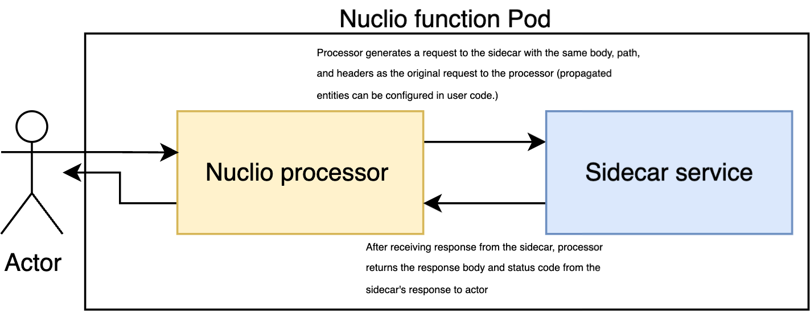

# Deploy function with http service

This tutorial explains how to deploy http service along nuclio function and use nuclio processor as a proxy container to user's http service. 

# In this document:
- [Design](#design)
- [Example](#example)

## Design
**(!) Important: Currently Nuclio supports such configuration only for the `Go` runtime.**

In order to allow the user to deploy the HTTP service “as it is,” we propose to use the sidecar feature. 
Thus, in each function pod there will be at least two containers — a Nuclio processor and a user container with an HTTP service.
The idea is that the Nuclio processor pod acts as a proxy for the user service. 

When the processor receives a request, it assembles new requests from some components of the original request and sends it to the sidecar,
then the processor sends the response received from the sidecar to the user.



Here is the list of components of an HTTP request that can be propagated to the sidecar:
* Method 
  ```
  event.GetMethod()
  ```
* Path
  ```
  event.GetPath()
  ```
* Body
  ```
  event.GetBody()
  ```
* Headers (some headers are nuclio-related, so filter on user code side if needed — all of them have prefix `X-Nuclio`)
  ```
  event.GetHeaders()
  ```

## Example
Here is an example of handler function with propagating Path and Body from http response:

```go
package main

import (
	"fmt"
	"net/url"
	"os"

	nuclio "github.com/nuclio/nuclio-sdk-go"
	"github.com/valyala/fasthttp"
)

func Handler(context *nuclio.Context, event nuclio.Event) (interface{}, error) {
	sidecarHost := os.Getenv("SIDECAR_HOST")
	sidecarPort := os.Getenv("SIDECAR_PORT")
	// url for request forwarding
	sidecarUrl, _ := url.JoinPath(fmt.Sprintf("%s:%s", sidecarHost, sidecarPort), event.GetPath())

	// create new request to forward
	req := fasthttp.AcquireRequest()
	resp := fasthttp.AcquireResponse()

	// set body and request uri
	req.SetBody(event.GetBody())
	req.SetRequestURI(sidecarUrl)

	// sending request to sidecar
	context.Logger.InfoWith("Forwarding request to sidecar", "sidecarUrl", sidecarUrl)
	err := fasthttp.Do(req, resp)

	return nuclio.Response{
		StatusCode:  resp.StatusCode(),
		ContentType: "application/text",
		Body:        resp.Body(),
	}, err
}
```
And here is function config template:
```yaml
metadata:
  name: proxy-to-sidecar
spec:
  build:
    functionSourceCode: {{ .SourceCode }}
  description: "Proxy request from nuclio processor pod to sidecar http service"
  env:
    - name: SIDECAR_HOST
      value: {{ .SidecarHost }}
    - name: SIDECAR_PORT
      value: {{ .SidecarPort }}
  handler: "main:Handler"
  runtime: golang
  minReplicas: 1
  maxReplicas: 1
  sidecars:
   - name: {{ .SidecarName }}
     image: {{ .SidecarImage }}
  triggers:
    myHttpTrigger:
      kind: http
      maxWorkers: {{ .MaxWorkers }}
```

