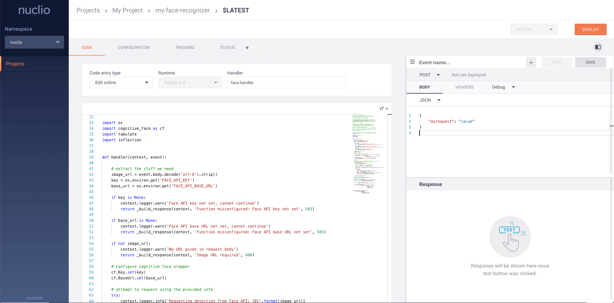

## Quick-start

The simplest way to explore Nuclio is to run its graphical user interface (GUI) of the Nuclio dashboard. All you need to run the dashboard is Docker:

```sh
docker run --detach --publish 8070:8070 --volume /var/run/docker.sock:/var/run/docker.sock --name nuclio-dashboard quay.io/nuclio/dashboard:stable-amd64
```



Browse to <a href="http://localhost:8070/" target="_blank">http://localhost:8070</a>, create a project, and add a function. When run outside of an orchestration platform (for example, Kubernetes), the dashboard will simply deploy to the local Docker daemon.

Assuming you are running Nuclio with Docker, as an example, create a project and deploy the pre-existing template "dates (nodejs)".
With `docker ps`, you should see that the function was deployed in its own container.
You can then invoke your function with curl; (check that the port number is correct by using `docker ps` or the Nuclio dashboard):

```sh
curl -X POST -H "Content-Type: application/text" -d '{"value":2,"unit":"hours"}' http://localhost:37975
```

For a complete step-by-step guide to using Nuclio over Kubernetes, either with the dashboard UI or the Nuclio command-line interface (`nuctl`), explore these learning pathways:

- [Getting Started with Nuclio on Kubernetes](../setup/k8s/getting-started-k8s)
- [Getting Started with Nuclio on Google Kubernetes Engine (GKE)](../setup/gke/getting-started-gke.md)
- [Getting started with Nuclio on Azure Container Services (AKS)](../setup/aks/getting-started-aks.md)
- [Hands-on live Kubernetes sandbox and guiding instructions for Nuclio, free on Katacoda](https://katacoda.com/javajon/courses/kubernetes-serverless/nuclio)
